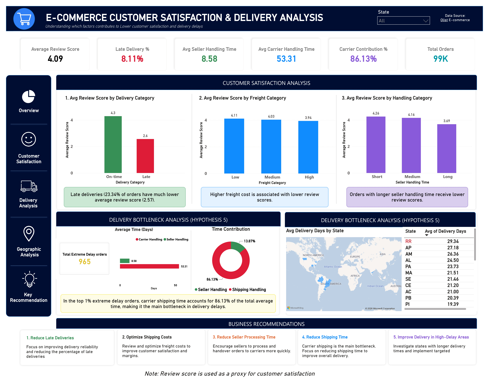

# olist-ecommerce-customer-satisfaction-analysis

# Business Question  
  Management has noticed that customer satisfaction has been inconsistent, and they want to understand which factor may be contributing to
  poor customer experiences.

# Overview 

  This project analyzes Brazilian E-commerce public dataset by olist to identify what factors are contributing to poor customer         
  satisfaction, where delivery problems occur, and what the main bottleneck is. Review score was used as a proxy for customer 
  satisfaction throughout the analysis. 
                    
  The analysis was conducted using Python/Pandas for data cleaning and feature engineering, SQL for data analysis and hypothesis testing,
  and Power BI for interactive dashboard development and communication of findings to non-technical users.

# Dataset

  Source : Brazilian E-Commerce Public Dataset by Olist 
  Data : 99441- Orders, 32951 - Products, 112650 - Orders_items, 99224 - Reviews and 99441 - customers
  Tables for this analysis: 
          Products, 
          Orders, 
          Order_items, 
          Review,
          Customers

# Tools Used 
      
  Python (pandas, numpy): Data Cleaning and Creating calculated columns
  SQL : Data analysis and Queries
  Power BI : Final Interactive Design

# Key Insight

  Late delivery is strongly associated with lower customer satisfaction: On-time orders had an average review score of 4.29, compared with 2.57
  for late orders.
  
  Higher freight cost is associated with lower review scores:** Average review score decreased from 4.11 (low) to 4.04 (medium) and 3.94 (high) 
  freight-cost categories.
  
  Product price showed little relationship with customer satisfaction:Average review score remained around 4.03 across price categories, so this    hypothesis was not supported.
  
  Longer seller handling is associated with lower satisfaction: The shortest handling category had an average review score of 4.26, while the       longest had 3.69.
  
  Carrier shipping is the main bottleneck in extreme delays: Among the top 1% longest-delivery orders (965 orders), average seller handling was     8.58 days, compared with 53.31 days for carrier shipping.
  
  Carrier contribution dominates extreme delays: Carrier shipping accounted for approximately 86.13% of the combined seller-handling and shipping   time, compared with 13.87% for seller handling.
  
  Geographic differences exist in delivery performance: RR State recorded the highest average delivery time in your state-level analysis at 29.34   days.
  
  Data-quality anomalies were identified during cleaning: 13,059 orders had a carrier delivery date later than the approval date. Instead of        deleting them, you retained and flagged these records for investigation.
  
  Overall insight: The analysis suggests that delivery performance and logistics are more important to customer satisfaction than product price     in the analyzed data.

# Main business takeaway

  Improving delivery reliability, seller processing time, carrier shipping performance, and high-delay geographic areas should be prioritized.

